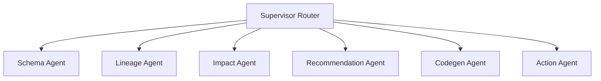

# DataGuardian AI 🛡️

> **An Autonomous Multi-Agent AI Copilot for Enterprise Data Governance & Lineage Impact Analysis**


---

# 📌 Overview

**DataGuardian AI** is a bi-directional AI copilot designed to bridge the gap between AI assistants and enterprise data governance catalogs. Built on top of **LangGraph** and **DataHub GMS**, DataGuardian AI executes complex multi-agent workflows—computing downstream blast radii, generating grounded dbt models, and mutating live metadata catalogs via GraphQL in real time.

Unlike static text wrappers, DataGuardian AI operates directly against active metadata instances, ensuring **zero-hallucination code generation** and **context-aware incident remediation**.

---

# ✨ Key Features

- 🔄 **Bi-Directional DataHub Integration** – Reads schemas, entities, and lineage graphs while executing live metadata updates through GraphQL mutations.
- 🤖 **Multi-Agent Orchestration** – Powered by **LangGraph**, dynamically routing tasks across specialized AI agents.
- 🎯 **Blast Radius & Impact Analysis** – Calculates downstream and upstream dependency risks before schema modifications.
- 🛠️ **Automated Remediation & Jira Generation** – Creates mitigation strategies and structured Jira tickets for governance incidents.
- ⚡ **Grounded dbt & SQL Code Generation** – Generates production-ready SQL and dbt models strictly from verified catalog metadata.
- ⚡ **Zero-Token Parsing Fallbacks** – Uses lightweight parsing before invoking the LLM to reduce latency and API cost.

---

# 🏗️ Multi-Agent Architecture

The execution pipeline is coordinated by a central **Supervisor Router** that dynamically delegates tasks across specialized AI agents.



## Agent Responsibilities

| Agent | Responsibility |
|-------|----------------|
| **Schema Agent** | Inspects physical table structures, field types, and column documentation. |
| **Lineage Agent** | Traverses upstream and downstream dependency graphs in DataHub. |
| **Impact Agent** | Calculates quantitative risk scores (0–100) and determines blast radius. |
| **Recommendation Agent** | Generates mitigation strategies and drafts Jira remediation tickets. |
| **Codegen Agent** | Produces production-ready, type-safe dbt models grounded in verified catalog schemas. |
| **Action Agent** | Executes live metadata mutations (descriptions, tags, ownership, etc.) directly in DataHub GMS. |

---

# 🛠️ Tech Stack

| Layer | Technology |
|--------|------------|
| **Frontend** | React.js (Vite), CSS3 Modules |
| **Backend API** | FastAPI (Python 3.11), Uvicorn |
| **AI Orchestration** | LangGraph, LangChain |
| **LLM** | Google Gemini (`gemini-2.0-flash`) |
| **Metadata Platform** | DataHub GMS (GraphQL & REST API) |
| **Deployment** | Docker Compose |

---

# 🚀 Quick Start Guide

## Prerequisites

- Docker & Docker Desktop
- Python 3.11+
- Node.js 18+
- Google Gemini API Key

---

## 1️⃣ Clone the Repository

```bash
git clone https://github.com/oza24/datahub_dataguardian-ai.git
cd dataguardian_ai
```

---

## 2️⃣ Start DataHub Catalog

```bash
python -m pip install acryl-datahub

datahub docker quickstart
```

Open DataHub:

```
http://localhost:9002
```

Default Login

```
Username: datahub
Password: datahub
```

---

## 3️⃣ Backend Setup

```bash
cd backend

python -m venv venv
```

### Windows

```bash
venv\Scripts\activate
```

### macOS / Linux

```bash
source venv/bin/activate
```

Install dependencies

```bash
pip install -r requirements.txt
```

Create `.env`

```env
GEMINI_API_KEY=your_actual_gemini_api_key_here
DATAHUB_GMS_URL=http://localhost:8080
```

Run backend

```bash
python -m uvicorn main:app --host 0.0.0.0 --port 8001 --reload
```

---

## 4️⃣ Frontend Setup

```bash
cd frontend

npm install

npm run dev
```

Open

```
http://localhost:5173
```

---

# 🧪 Sample Prompts

### 📖 Catalog Inspection

```
Inspect the schema and field types for orders
```

### 🔍 Lineage & Impact Analysis

```
What is the impact if I drop customer_id from dim_customers?
```

### ⚙️ Grounded Code Generation

```
Generate a production dbt model for orders
```

### ✏️ Live Metadata Mutation

```
Update description for dim_customers to "Master customer dimension containing verified profiles and loyalty tiers."
```

---

# 📄 License

This project is licensed under the **MIT License**.