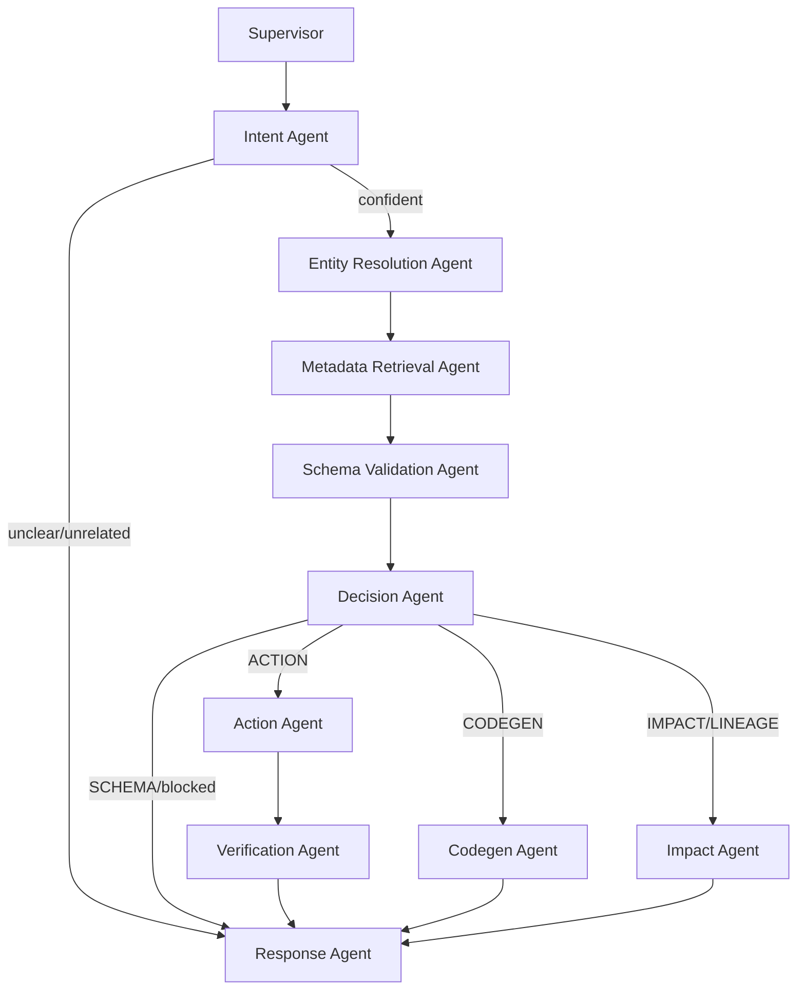

# DataGuardian AI 🛡️

> **An LLM-driven, multi-agent data governance copilot for DataHub — understands multilingual natural language and safely reads, validates, and mutates live catalog metadata.**


---

## 📌 Overview

**DataGuardian AI** lets a data team talk to their DataHub catalog the way they'd talk
to a colleague — in plain, mixed, or multilingual phrasing — and get a governance-safe
answer back: view a schema, update a description, or check what breaks before a column
is dropped.

Every request is understood by an LLM (no regex, no keyword lists, no hardcoded table/
field aliases), resolved against **live** DataHub schema and lineage data (never
fabricated), validated for confidence before anything is mutated, and verified after
the mutation actually lands — with every failure mode classified into a specific,
actionable error instead of a raw exception.

---

## ✨ Key Features

- 🌐 **True multilingual understanding** — including mixed-language sentences, handled
  by LLM reasoning rather than translation rules or per-language logic.
- 🎯 **Semantic entity resolution** — table and column names are matched via embedding
  similarity against what DataHub actually returns, so shorthand, casing variants, and
  everyday phrasing all resolve to the same real field without an alias table.
- 🛡️ **Confidence-gated actions** — low-confidence intent or an ambiguous field/table
  match triggers a clarifying question instead of a guess.
- 🔁 **Self-healing mutations** — recoverable DataHub errors (timeouts, transient
  unavailability, conflicts) are retried automatically; non-recoverable ones fail fast
  with a clear reason.
- ✅ **Post-mutation verification** — every successful update is re-read from DataHub
  to confirm it actually persisted before reporting success.
- 📛 **Classified error taxonomy** — every failure (permission, schema mismatch,
  network, GraphQL validation, etc.) maps to a specific error code, reason, and
  suggestion — never "Unknown GraphQL Error".
- ⚡ **Grounded code generation** — dbt models are generated strictly from the
  verified live schema, so every column in the output is real.

---

## 🏗️ Architecture



The backend is a layered service, not a monolith — each concern lives in exactly one
place:

```
backend/app/
  config.py         tunables: model names, confidence thresholds, retry counts
  models/            Pydantic contracts (LLM structured output, error taxonomy)
  prompts/           system prompts, versioned separately from agent logic
  services/          llm_service.py (chat), embedding_service.py (semantic matching)
  graphql/           the only place raw DataHub GraphQL strings live
  repositories/       the only place that talks to DataHub GMS
  matching/          embedding-based candidate ranking (replaces alias tables)
  validation/        pure functions over a fetched schema
  errors/            classifies exceptions/GraphQL errors into a typed taxonomy
  state/             single LangGraph state definition
  agents/            one node per pipeline stage
  graph/workflow.py  LangGraph wiring and routing
```


---

## 🛠️ Tech Stack

- **Frontend:** React (Vite), Tailwind
- **Backend API:** FastAPI (Python 3.11), Uvicorn
- **Agent Orchestration:** LangGraph, LangChain, Google Gemini (`gemini-3.6-flash`)
- **Semantic Matching:** Gemini embeddings (`gemini-embedding-001`) via `google-genai`
- **Metadata Catalog:** DataHub GMS (GraphQL)
- **Deployment:** Docker Compose

---

## 🚀 Quick Start

### Prerequisites
- [Docker & Docker Desktop](https://www.docker.com/)
- [Python 3.11+](https://www.python.org/)
- [Node.js 18+](https://nodejs.org/)
- A Google Gemini API key

### 1. Clone the repository
```bash
git clone https://github.com/<your-username>/dataguardian-ai.git
cd dataguardian_ai
```

### 2. Start DataHub
```bash
python -m pip install acryl-datahub
datahub docker quickstart
```
DataHub's UI will be available at `http://localhost:9002` (login: `datahub` / `datahub`).

### 3. Backend
```bash
cd backend
python -m venv venv
source venv/bin/activate        # Windows: venv\Scripts\activate
pip install -r requirements.txt
cp .env.example .env             # then set GEMINI_API_KEY in .env
uvicorn main:app --host 0.0.0.0 --port 8000 --reload
```

### 4. Frontend
```bash
cd frontend
npm install
npm run dev                      # http://localhost:5173
```

### 5. Sanity check
```bash
curl http://localhost:8000/health
curl -X POST http://localhost:8000/api/chat \
  -H "Content-Type: application/json" \
  -d '{"prompt": "show me the schema for the orders table"}'
```

---

## ⚙️ Configuration

All tunables live in `backend/app/config.py` and are overridable via `.env`:

| Variable | Purpose | Default |
|---|---|---|
| `GEMINI_API_KEY` | Google Gemini API key | — |
| `GEMINI_CHAT_MODEL` | Chat model for intent/reasoning | `gemini-3.6-flash` |
| `GEMINI_EMBEDDING_MODEL` | Embedding model for semantic matching | `gemini-embedding-001` |
| `DATAHUB_GMS_URL` | DataHub GMS base URL | `http://localhost:8080` |
| `DATAHUB_GMS_TOKEN` | DataHub GMS auth token (if required) | — |
| `TABLE_MATCH_CONFIDENCE_THRESHOLD` | Min similarity to accept a table match | `0.68` |
| `FIELD_MATCH_CONFIDENCE_THRESHOLD` | Min similarity to accept a field match | `0.72` |
| `INTENT_CONFIDENCE_THRESHOLD` | Min confidence to act without clarifying | `0.55` |
| `MAX_MUTATION_RETRIES` | Self-healing retry attempts on recoverable errors | `2` |

Google periodically deprecates Gemini model IDs — if you see a `404 NOT_FOUND` on
startup, check [Gemini's model list](https://ai.google.dev/gemini-api/docs/models)
and update `GEMINI_CHAT_MODEL` accordingly.

---

## 📄 License

MIT